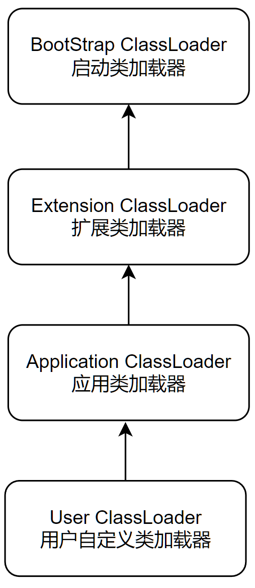
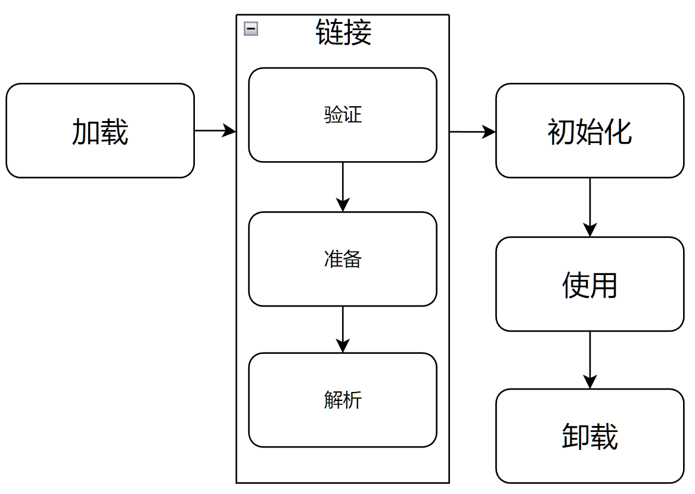
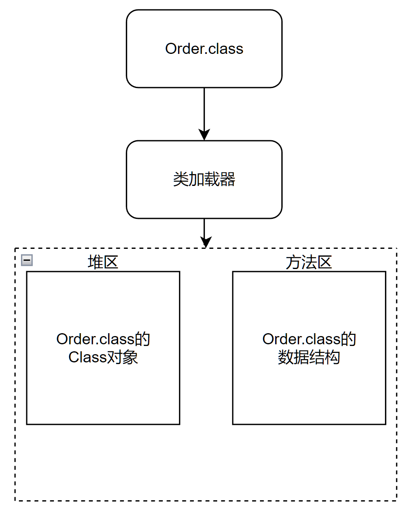
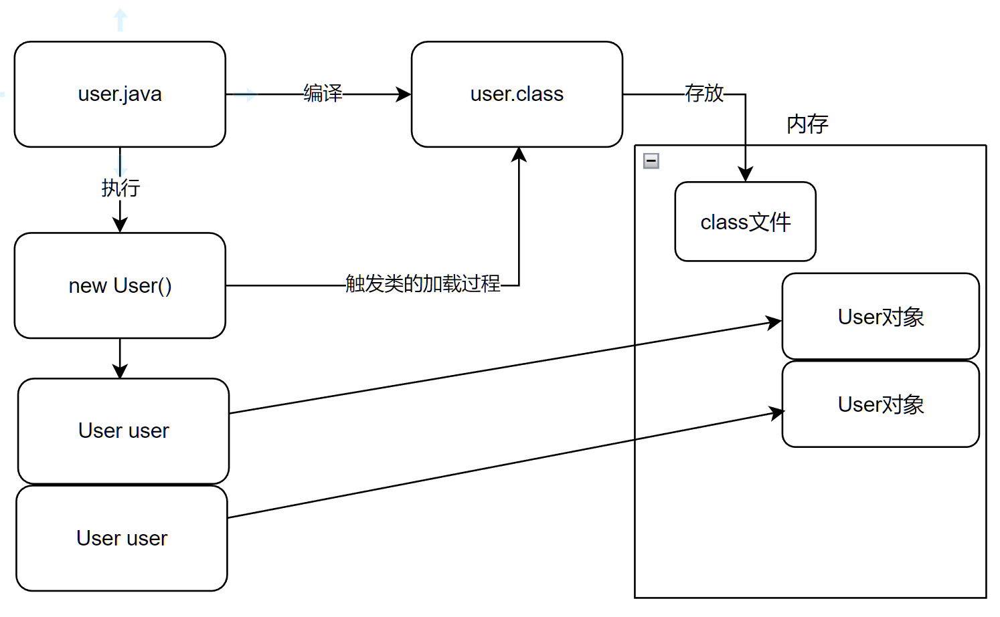

# 反射技术

&emsp;&emsp;动态加载一个指定的类，并获取该类中的所有的内容。而且将字节码文件封装成对象，并将字节码文件中的内容都封装成对象，这样便于操作这些成员。简单说：反射技术可以对一个类进行解剖。  
&emsp;&emsp;反射的好处：大大的增强了程序的扩展性。

## 双亲委派机制

&emsp;&emsp;当一个类加载器收到了类加载的请求的时候，他不会直接去加载指定的类，而是把这个请求委托给自己的父加载器去加载。只有父加载器无法加载这个类的时候，才会由当前这个加载器来负责类的加载。  
&emsp;&emsp;java中支持的类加载器 :

1. Bootstrap ClassLoader 启动类加载器  
   &emsp;&emsp;主要负责加载Java核心类库，%JRE_HOME%\lib下的rt.jar、resources.jar、charsets.jar和class等。
2. Extention ClassLoader 标准扩展类加载器  
   &emsp;&emsp;主要负责加载目录%JRE_HOME%\lib\ext目录下的jar包和class文件。
3. Application ClassLoader 应用类加载器  
   &emsp;&emsp;主要负责加载当前应用的classpath下的所有类.
4. User ClassLoader 用户自定义类加载器  
   &emsp;&emsp;用户自定义的类加载器,可加载指定路径的class文件

它们之间的层级关系 :  
 一般以为上一层是下一层的父加载器。

### 为什么要使用双亲委派机制

&emsp;&emsp;比如String类，他是java.lang包下的，所以他会委托到BootStrap ClassLoader中，最终被BootStrap ClassLoader加载。  
&emsp;&emsp;而用户自定义的类，也会委托到BootStrap ClassLoader中，但是BootStrap ClassLoader不负责加载，就会委托到Extension
ClassLoader中，但是Extension ClassLoader也不负责加载，最终由Application ClassLoader加载。  
&emsp;&emsp;这样做的好处有 :

1. 可以防止核心API被篡改，保证了安全性。   
   &emsp;&emsp;比如在目录下创建一个java.lang包，在里面自定义一个String类，那么当我们调用String类时不会调用到自定义的String类。
2. 防止类的重复加载。  
   &emsp;&emsp;一个类只能由一个类加载器进行加载。

**注意 : 父加�d器和子加�d器不是�^承�P�S而是�M合�P�S**  
&emsp;&emsp;&emsp;**在ClassLoader��中的parent指向父加�d器。**

### 双亲委派机制实现

源代码在ClassLoader类的loadClass()中。

```java
protected Class<?> loadClass(String name,boolean resolve)
		throws ClassNotFoundException
		{
synchronized (getClassLoadingLock(name)){
		// First, check if the class has already been loaded
		Class<?> c=findLoadedClass(name);
		if(c==null){
		long t0=System.nanoTime();
		try{
		if(parent!=null){
		c=parent.loadClass(name,false);
		}else{
		c=findBootstrapClassOrNull(name);
		}
		}catch(ClassNotFoundException e){
		// ClassNotFoundException thrown if class not found
		// from the non-null parent class loader
		}
		
		if(c==null){
		// If still not found, then invoke findClass in order
		// to find the class.
		long t1=System.nanoTime();
		c=findClass(name);
		
		// this is the defining class loader; record the stats
		PerfCounter.getParentDelegationTime().addTime(t1-t0);
		PerfCounter.getFindClassTime().addElapsedTimeFrom(t1);
		PerfCounter.getFindClasses().increment();
		}
		}
		if(resolve){
		resolveClass(c);
		}
		return c;
		}
		}
```

**步骤 :**

1. **先判断这个类是否加载过**
2. **若没有加载则调用父加载器的loadClass()方法进行加载**
3. **若父加载器为空则默认使用启动类加载器作为父加载器**
4. **如果父类加载失败，抛出ClassNotFoundException异常后，再调用自己的findClass()方法进行加载**

## 类的加载过程

生命周期 :   


1. 加载  
   将Java类的字节码文件加载到机器内存中，并在内存中构建出Java的原型（类模板对象）。
    1. 加载类时，java虚拟机的加载步骤 :
        1. 根据类的全名，获取类的二进制数据流
        2. 解析类的二进制数据流为方法区内的数据结构
        3. 创建java.lang.Class类的实例，作为方法区这个类各种数据的访问入口
    2. 类模型与class文件的位置
        1. 类模型存储在方法区
        2. class文件加载到元空间后，会在堆中创建一个Class对象，用于封装类位于方法区内的数据结构。每一个类都对应一个Class对象。
           
        3. 数组类的加载  
           &emsp;&emsp;数组类本身并不是由类加载器负责创建，而是由jvm在运行时根据需要直接创建的，但是数组的元素类型仍然需要依靠类加载器去创建。  
           **步骤**
            1. 如果数组的元素类型是引用类型，那么遵循定义的加载过程递归加载和创建数组A的元素类型。
            2. jvm使用指定的元素类型和数组维度类创建新的数组类。
2. 链接
    1. 验证  
       &emsp;&emsp;确保class文件的字节流中包含的信息符合当前虚拟机需求，保证被加载的类的正确性，不会危害虚拟机自身安全。  
       &emsp;&emsp;主要包括 : 文件格式验证、元数据验证、符号引用验证、字节码验证。
    2. 准备  
       &emsp;&emsp;为类变量分配内存并且设置该类变量的默认初始值，即零值。  
       &emsp;&emsp;不包括final修饰的static，因为final在编译的是偶就会分配，准备阶段会显式初始化。  
       &emsp;&emsp;这里不会为实例变量分配初始化，类变量会分配在方法区中，而实例变量会随着对象一起分配到java堆中。
    3. 解析  
       &emsp;&emsp;将接口，字段和方法的符号引用转换为直接引用。  
       &emsp;&emsp;java虚拟机为每一个类都准备一张方法表，将其所有的方法列在其中，当需要调用一个类的方法时，只要知道这个方法在方法表的偏移量（通过解析操作，符号引用转换为直接引用类中的方法表中的位置），就可以直接调用该方法了。  
       &emsp;&emsp;不过java虚拟机规范并没有明确要求解析阶段一定要按序执行，在hotspot中，按照加载，验证，准备和初始化的顺序执行，但链接阶段的解析操作往往伴随着jvm执行完初始化之后再执行。
3. 初始化
    1. 初始化阶段就是执行类构造器方法`<clinit>()`的过程。
    2. 此方法不需定义，是javac编译器自动收集类中的所有类变量的赋值动作和静态代码块中的语句合并而来。
    3. 构造器方法中指令按语句在源文件中出现的顺序执行。
    4. `<clinit>()`不同于类的构造器。（关联：构造器是虚拟机视角下的<init>()）。
    5. 若该类具有父类，JVM会保证子类的`<clinit>()`执行前，父类的`<clinit>()`已经执行完毕。
    6. 虚拟机必须保证一个类的`<clinit>()`方法在多线程下被同步加锁。

## User user = new User();的加载



## 反射的基本原理

&emsp;&emsp;在调用到该类时就会通过类加载器在内存中保存该类的信息（只有一份），反射就是获取该类在内存中的信息，可以对该类进行操作。

## 反射技术创建对象

```java
import java.lang.reflect.InvocationTargetException;

public class CreatingByReflex {
	
	public static void main(String[] args) {
	}
	
	/**
	 * 创建Class对象的方式
	 * @throws ClassNotFoundException
	 */
	@Test
	public void test2() throws ClassNotFoundException {
		Class<Emaple> aClass1 = Emaple.class;
		Class<?> aClass = Class.forName("com/xiaoyi/Emaple.java");
	}
	
	/**
	 * 通过构造器
	 * @throws InstantiationException
	 * @throws IllegalAccessException
	 * @throws NoSuchMethodException
	 * @throws InvocationTargetException
	 */
	@Test
	public void test1()
			throws InstantiationException, IllegalAccessException, NoSuchMethodException,
			InvocationTargetException {
		Emaple emaple1 = Emaple.class.getDeclaredConstructor().newInstance();
		Emaple emaple2 =
				Emaple.class.getDeclaredConstructor(Integer.class, String.class).newInstance(1, "hello");
	}

}
```

**说明**  
&emsp;&emsp;由于Java中不建议使用通过Class对象直接调用newInstance()方法，而是推荐使用先调用getDeclaredConstructor()再调用newInstance()
，所以在接下来的例子中都是使用推荐的方法。

## 反射获取成员属性

### 给成员属性赋值

```java
public class AssignForFlied {
	
	public static void main(String[] args)
			throws ClassNotFoundException, NoSuchFieldException, IllegalAccessException,
			NoSuchMethodException, InvocationTargetException, InstantiationException {
		// 创建Class对象
		Class<?> clazz = Class.forName("com.xiaoyi.domain.Emaple");
		// 通过构造器创建Emaple实例
		Emaple emaple = (Emaple) clazz.getConstructor().newInstance();
		// 获取成员属性
		Field id = clazz.getDeclaredField("id");
		// 设置访问权限
		id.setAccessible(true);
		// 赋值
		id.set(emaple, 12);
		System.out.println(emaple.toString());
	}
}
```

**说明**  
&emsp;&emsp;在给私有的成员属性赋值的时候要先设置权限。调用私有方法也是如此。

### 调用方法

```java
public class InvokingMethod {
	public static void main(String[] args)
			throws ClassNotFoundException, NoSuchMethodException, InvocationTargetException,
			InstantiationException, IllegalAccessException {
		// 创建Class对象
		Class<?> aClass = Class.forName("com.xiaoyi.domain.Emaple");
		// 创建Emaple实例
		Emaple emaple = (Emaple) aClass.getDeclaredConstructor().newInstance();
		// 获取方法
		Method hello = aClass.getDeclaredMethod("hello", String.class);
		// 设置权限
		hello.setAccessible(true);
		// 调用方法
		hello.invoke(emaple, "jet");
	}
}
```